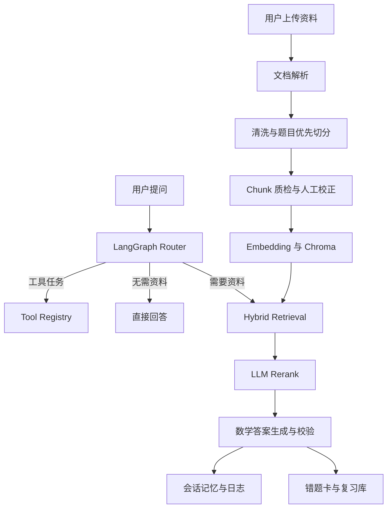

# Math-learning-agent 数学学习助手

一个面向数学学习场景的对话式 RAG Agent。系统以 AI 对话为主要工作区，以资料解析、Chunk 质量检查、来源追溯和错题复习为辅助能力，支持从 PDF、Word、TXT 和图片中读取题目，完成检索、讲解、错题卡生成和复习管理。

> 当前 README 同时承担三种职责：新用户启动指南、系统原理说明、开发者维护手册。文档中的命令和模块说明以当前仓库代码为准。

## 1. 项目定位

普通聊天模型可以解释一道已经完整输入的题目，但面对整份试卷或讲义时，通常还需要解决以下问题：

- 如何从复杂 PDF 中可靠提取正文、公式、题号和选项；
- 如何保证一个 Chunk 尽量对应一道完整题，而不是在题干中间断开；
- 如何让“第 3 题”准确命中第 3 题，而不是只做模糊语义匹配；
- 如何展示答案依据，让用户能够检查模型引用了什么内容；
- 如何把一次问答沉淀为可编辑、可复习、可导出的错题记录；
- 如何用测试、环境检查和评测数据判断一次修改是否引入回归。

本项目围绕上述链路构建，不只是调用一次大模型 API，而是提供从资料进入系统到学习结果沉淀的完整流程。

## 2. 核心能力

| 能力 | 当前实现 | 原理 | 采用理由 |
| --- | --- | --- | --- |
| 多格式输入 | PDF、DOCX、TXT、PNG、JPG、JPEG、WebP | 不同解析器统一输出 LangChain `Document` | 后续清洗、切分和检索只处理一种数据结构，降低模块耦合 |
| 数学 PDF 解析 | MinerU 优先，pypdf 回退 | MinerU 提取复杂版面和公式；失败时逐页提取文本 | 数学资料版式复杂，但系统不能因增强解析器失败而完全不可用 |
| 图片 OCR | Qwen 视觉模型 | 图片编码为 data URL 后发送给 OCR 模型 | 支持拍照题目和扫描题，不要求用户先手工转写 |
| 试卷文本清洗 | 保守规则清洗 | 删除来源 URL、修复题号/选项换行、压缩异常空白，同时避开 LaTeX | 改善题目边界，又不擅自改写公式或补造缺失内容 |
| 题目优先切分 | 题号识别 + 递归字符切分回退 | 先按题号形成题块，过长或无法识别时再按字符切分 | 单题完整性对数学问答通常比固定长度更重要 |
| Chunk 质检与校正 | 质量标签、调试面板、人工修正持久化 | 检查结构异常并允许保存修正文案 | 自动解析不可能覆盖所有版式，人工闭环可处理长尾错误 |
| 向量检索 | Qwen Embedding + Chroma | 文本向量化后做相似度召回 | 解决自然语言表达不同但语义相近的问题 |
| 混合检索 | 向量分数 + 题号/题型/关键词规则分数 | 有明确题号时提高规则权重，否则提高向量权重 | 数学资料既需要语义召回，也需要精确定位 |
| LLM Rerank | 候选 Chunk 二次相关性评分 | 先广召回，再由模型选择最终上下文 | 减少相似题、重复页眉和邻题进入最终答案 |
| Agent 编排 | LangGraph | Router 将任务分发到工具、直接回答或 RAG 路径 | 让控制流显式、可测试、可扩展，而不是堆叠在 UI 条件分支中 |
| 输出校验 | 结构校验与修复 | 检查数学解析字段，失败时执行格式修复 | 下游错题卡和导出依赖稳定结构，不能只相信模型自由输出 |
| 会话记忆 | SQLite | 按 session 保存问题、答案和运行元数据 | 页面刷新后仍可追溯历史，同时避免只依赖临时 session state |
| 错题系统 | SQLite + PNG/HTML/PDF | 保存题干、解析、难度、标签、来源和复习状态 | 将一次回答转化为长期学习资产 |
| 工程验证 | 单元测试 + 环境检查 + Streamlit smoke + Eval V2 | 从静态语法、确定性行为、运行环境到在线效果分层验证 | 不同问题需要不同成本的验证，不能每次都依赖人工点页面 |

## 3. 用户工作流

### 3.1 最短使用路径

1. 启动应用并打开 Streamlit 页面。
2. 上传一份或多份数学资料。
3. 等待系统完成读取、清洗、Chunk 和向量库构建。
4. 在“AI 对话主工作区”提问，例如“选择题第 2 题为什么选 B”。
5. 展开检索片段，核对题目来源和命中依据。
6. 对需要巩固的题目生成错题卡，编辑确认后加入错题库。
7. 在侧栏更新复习状态或导出错题 PDF。

### 3.2 为什么把对话作为主区域

用户的目标通常是“理解题目”，不是“管理解析管线”。因此页面把对话放在主要操作位置，把资料解析、Chunk 调试和错题管理作为辅助面板。这样既保留开发调试所需的透明度，又减少普通用户第一次使用时面对大量工程信息的负担。

### 3.3 推荐提问方式

- 精确题号：`讲解选择题第 3 题，并说明每个选项为什么对或错。`
- 指定来源：`根据上传资料解释中心极限定理。`
- 追问：`上一步为什么可以使用这个公式？`
- 总结：`总结这份资料中关于假设检验的知识点。`
- 工具任务：`计算 (12 + 8) * 3。`
- 错题沉淀：`把刚才这道题整理成错题卡。`

明确题号能够触发规则检索，具体任务要求能够帮助 Router 选择合适路径。追问会结合有限历史消息改写为可独立检索的问题，降低“它”“上一步”等指代造成的歧义。

## 4. 系统架构



### 4.1 分层原则

- `app.py` 负责 Streamlit 页面组装和交互，不应承载大量可复用业务算法。
- `ui/` 负责主题和可视化组件。
- `state/` 负责 Streamlit session state 的初始化和重置。
- `services/` 负责解析、切分、检索、Agent、记忆、错题和导出等业务能力。
- `validators/` 负责模型输出和任务结构校验。
- `prompts/` 集中管理不同任务的提示词。
- `tests/` 提供离线、确定性的回归测试。
- `evals/` 评估包含模型和检索在内的端到端效果。

采用这种边界的原因是：UI 会频繁变化，而检索、数据库和解析算法需要独立测试。将两者分开后，修改页面样式不会迫使开发者同时重测所有业务细节。

## 5. 文档解析原理

### 5.1 文件路由

`services/document_loader.py` 根据扩展名选择解析器：

- PDF：先尝试 MinerU，失败后回退 pypdf；
- DOCX：分别读取正文段落和表格；
- TXT：先尝试 UTF-8，失败后尝试 GBK；
- 图片：调用 Qwen 视觉模型 OCR；
- 多文件：逐个解析后合并为统一的 `Document` 列表。

每个 `Document` 都附带 `source`、`file_type`、`location` 等元数据。这些字段会继续进入 Chunk、检索解释和错题来源，因此不能在中间步骤随意删除。

### 5.2 MinerU 为什么优先但不是唯一方案

数学 PDF 常包含双栏、表格、上下标和公式。pypdf 更接近“按 PDF 内部文本对象读取”，速度快但可能产生顺序错乱；MinerU 更强调版面分析，通常更适合复杂资料，但安装重、耗时更长，也可能因模型、路径或资源问题失败。

因此当前策略是：

1. 开启 `USE_MINERU_FOR_PDF` 时先运行 MinerU；
2. 大文件按页分批，默认每 5 页一批，降低单次失败影响；
3. 对 Markdown 去除页码和重复短页眉/页脚；
4. 通过文件 hash 缓存解析结果，避免重复消耗；
5. MinerU 没有产生可用文档时自动回退 pypdf。

这个设计追求“增强能力失败时仍可用”，而不是让 MinerU 成为单点故障。

### 5.3 PDF 质量评分

质量检测会观察文本长度、乱码比例、空行比例、内容密度、题号数量、选项数量、数学符号和重复短行等指标，并生成质量等级和问题说明。

质量分数不是数学正确率，也不能证明公式全部识别正确。它的用途是快速识别明显失败的解析结果，并提醒用户进入 Chunk 调试面板检查。

## 6. Chunk 清洗与切分

### 6.1 当前切分顺序

```text
原始 Document
-> 试卷文本规范化
-> 尝试识别题号边界
-> 按完整题目形成题块
-> 对过长题块或未识别文本执行递归字符切分
-> 添加 chunk_id 和质量元数据
-> 应用已保存的人工修正
```

### 6.2 数据清洗做什么

`services/exam_text_cleaner.py` 当前执行保守清洗：

- 统一换行符；
- 删除独立来源 URL；
- 把粘连在正文中的题号移动到新行；
- 把粘连的 `A.` 到 `D.` 选项移动到新行；
- 规范选择括号和多余空格；
- 合并异常空行；
- 对 `$...$` LaTeX 片段跳过上述文本变换。

跳过 LaTeX 的原因是普通正则清洗容易破坏公式空格、转义符和命令结构。这里宁可少修，也不应“修复”出错误公式。

### 6.3 题目优先切分

`services/question_chunker.py` 可识别以下常见题号：

- `第 1 题`、`第（一）题`；
- `1.`、`1．`、`1、`；
- `一、`、`一.`；
- `①` 到 `⑩`。

同一文档至少识别到 `QUESTION_CHUNK_MIN_MARKERS` 个题号时，系统才启用题目切分，默认值为 2。这样可以避免正文里偶然出现一个编号时被错误切开。

题块长度不超过 `QUESTION_CHUNK_MAX_CHARS`，默认 2500 字符时，会整体保留。原因是题干、条件、选项和小问共同构成语义，强行切断会直接降低检索和讲题质量。

### 6.4 递归字符切分回退

无法可靠识别题目边界或题块过长时，系统使用 `RecursiveCharacterTextSplitter`：

| 参数 | 默认值 | 理由 |
| --- | --- | --- |
| `CHUNK_SIZE` | 800 | 在上下文完整性、Embedding 表达和调用成本之间折中 |
| `CHUNK_OVERLAP` | 120 | 保留边界两侧上下文，减少定义或条件被截断 |
| `CHUNK_SEPARATORS` | 段落、换行、句号、逗号、空格、字符 | 优先在自然语义边界切分，最后才按字符硬切 |

这些是字符数，不是模型 token 数。调整参数后需要重新建立向量库，并使用真实试卷验证题目完整率和检索命中率。

### 6.5 Chunk 调试与人工校正

系统为每个 Chunk 添加编号、来源、位置、题号标记和质量检查结果。调试面板可筛选、查看并修正问题 Chunk；人工修正会持久化，并在后续切分结果上重新应用。

人工校正存在的理由是 OCR 和复杂版面解析有不可避免的长尾错误。纯自动规则越激进，越容易误改公式；保守自动化加可追溯人工修正更适合学习资料。

## 7. RAG 与 Agent 工作流

### 7.1 Router

每次提问先由 Router 判断任务类型、是否需要资料以及输出形式：

- 工具任务进入 `tool_node`；
- 闲聊或无需文档的问题进入 `direct_answer_node`；
- 资料问答进入 `rag_retrieval_node`，然后进入答案节点。

Router 失败时会回退为普通 RAG 问答，理由是分类错误不应直接中断用户请求。

### 7.2 混合检索

向量检索擅长语义相似，但对“第 2 题”这种短而精确的引用并不稳定。规则检索会解析题型、阿拉伯数字、中文数字、圈号和选项字母，再结合 Chunk 内容与元数据打分。

当前权重：

- 问题包含明确题号时：向量 0.35，规则 0.65；
- 普通语义问题：向量 0.75，规则 0.25。

最终结果保留检索方式、向量距离、规则命中原因和综合分数，供页面解释和问题排查。

### 7.3 Rerank

系统默认先召回最多 12 个候选，再由 LLM 评分并保留任务所需数量。普通问答默认 3 个，摘要和知识点提取默认 5 个。

先召回后重排的理由是：只取前三个向量结果可能漏掉真正题目，而把大量 Chunk 全部发送给答案模型又会增加噪声和成本。Rerank 在召回率和上下文精度之间增加了一层选择。

### 7.4 输出校验

数学模式要求结果包含解析、难度、题型和标签等结构。验证器会规范难度、题型、标签和解析文本，并检查选择题、填空题等关键格式。必要时触发修复流程。

这里校验的是结构和可消费性，不等同于证明数学答案绝对正确。高风险场景仍应由用户检查推导和来源。

## 8. 错题与复习系统

错题库使用 SQLite 保存：

- 原始题干与解析；
- 难度、题型和标签；
- 来源文件、位置和 Chunk ID；
- 卡片图片与 HTML 路径；
- 错误原因；
- 复习状态、下次复习时间、最近复习时间和复习次数。

数据库新增字段采用幂等迁移：启动时检查现有列，只补充缺失字段，不删除或重建用户数据。原因是错题属于长期资产，升级功能不能以清空数据库为代价。

错题卡支持传统图片渲染以及 MathJax HTML 渲染。MathJax 更适合公式排版，但依赖浏览器和脚本资源；传统图片渲染作为更简单的基础路径。批量错题可以导出 PDF。

## 9. 本地安装

### 9.1 环境要求

- Windows PowerShell；
- Python 3.11 或 3.12。当前本地虚拟环境为 Python 3.12，Docker 基础镜像为 Python 3.11；
- 可访问 Qwen/DashScope OpenAI Compatible API；
- 可选：MinerU，用于增强 PDF 解析；
- 可选：Playwright Chromium，用于 HTML 错题卡截图。

### 9.2 创建虚拟环境

```powershell
py -m venv .venv
.\.venv\Scripts\python.exe -m pip install --upgrade pip
```

使用项目内虚拟环境能够隔离依赖，避免系统 Python 中其他项目的包版本影响本项目。

### 9.3 安装依赖

核心应用：

```powershell
.\.venv\Scripts\python.exe -m pip install -r requirements-core.txt
```

MinerU 和 HTML 卡片截图能力：

```powershell
.\.venv\Scripts\python.exe -m pip install -r requirements-mineru.txt
.\.venv\Scripts\playwright.exe install chromium
```

开发与测试：

```powershell
.\.venv\Scripts\python.exe -m pip install -r requirements-dev.txt
```

`requirements.txt` 是历史完整环境冻结，包含大量传递依赖。新环境优先使用拆分后的依赖文件，因为安装更快、用途更清楚，也更容易定位失败来源。

### 9.4 配置环境变量

```powershell
Copy-Item .env.example .env
```

然后编辑本地 `.env`，至少替换：

```dotenv
QWEN_API_KEY=你的实际密钥
QWEN_BASE_URL=https://dashscope.aliyuncs.com/compatible-mode/v1
QWEN_CHAT_MODEL=qwen3.7-plus
QWEN_OCR_MODEL=支持视觉输入的模型名
QWEN_EMBEDDING_MODEL=text-embedding-v4
```

`.env` 已被 Git 忽略，不应提交。`.env.example` 只保存占位值和公开默认配置。密钥一旦出现在聊天记录、提交历史或工单中，应立即轮换，而不是只删除当前文件。

### 9.5 启动前检查

```powershell
.\.venv\Scripts\python.exe scripts\check_env.py
```

它会检查密钥是否为占位值、核心包能否导入、MinerU 命令、Playwright 浏览器、SQLite 路径、运行目录和 MathJax URL。检查不会输出真实 API Key。

需要额外验证 MathJax CDN 网络访问时：

```powershell
.\.venv\Scripts\python.exe scripts\check_env.py --online
```

### 9.6 启动应用

推荐入口：

```powershell
.\scripts\start.ps1
```

该脚本先执行环境检查，再启动 Streamlit，适合日常使用。

也可以直接启动：

```powershell
.\.venv\Scripts\streamlit.exe run app.py
```

默认访问地址为 `http://localhost:8501`。

## 10. 环境变量说明

| 变量 | 默认值/示例 | 作用与理由 |
| --- | --- | --- |
| `QWEN_API_KEY` | 必填 | API 身份凭证，只能放在本地或部署密钥管理器 |
| `QWEN_BASE_URL` | DashScope compatible URL | 统一使用 OpenAI Compatible 客户端 |
| `QWEN_CHAT_MODEL` | `qwen3.7-plus` | Router、回答、修复和 Rerank 使用的聊天模型 |
| `QWEN_OCR_MODEL` | 视觉模型 | 图片 OCR 必须支持图像输入 |
| `QWEN_EMBEDDING_MODEL` | `text-embedding-v4` | Chunk 向量化模型；更换后应重建向量缓存 |
| `USE_MINERU_FOR_PDF` | `true` | 控制是否优先尝试增强 PDF 解析 |
| `MINERU_CMD` | `.venv/Scripts/mineru.exe` | 允许不同机器覆盖可执行文件路径 |
| `MINERU_METHOD` | `auto` | 让 MinerU根据 PDF 类型选择处理方式 |
| `MINERU_PAGE_BATCH_SIZE` | `5` | 降低大 PDF 单批内存和失败范围 |
| `MINERU_ENABLE_CACHE` | `true` | 避免同一 PDF 重复解析 |
| `ENABLE_QUESTION_CHUNKING` | `true` | 优先保证单题完整性 |
| `QUESTION_CHUNK_MIN_MARKERS` | `2` | 防止偶然编号触发错误切分 |
| `QUESTION_CHUNK_MAX_CHARS` | `2500` | 限制超长题块，避免上下文过大 |
| `ENABLE_VECTOR_CACHE` | `true` | 复用相同 Chunk 集合的 Chroma 索引 |
| `ENABLE_SQLITE_MEMORY` | `true` | 持久化会话历史 |
| `MEMORY_DB_PATH` | `data/memory.db` | 会话数据库位置 |
| `ENABLE_WRONGBOOK` | `true` | 开启错题持久化功能 |
| `WRONGBOOK_DB_PATH` | `data/wrongbook.db` | 错题数据库位置 |
| `CARD_OUTPUT_DIR` | `data/cards` | PNG 卡片输出目录 |
| `CARD_HTML_OUTPUT_DIR` | `data/card_html` | HTML 卡片输出目录 |
| `WRONGBOOK_PDF_OUTPUT_DIR` | `data/wrongbook_exports` | 错题 PDF 输出目录 |
| `MATHJAX_CDN_URL` | jsDelivr MathJax | 公式卡片渲染脚本，可替换为内网地址 |

相对路径会基于项目根目录解析，因此从不同终端目录启动也不会把数据写到意外位置。

## 11. 验证与测试

### 11.1 快速 Harness

```powershell
.\.venv\Scripts\python.exe scripts\run_harness.py --mode quick
```

依次执行：

1. 所有 Python 文件语法编译；
2. `tests/` 下的离线单元测试；
3. 环境和运行路径检查。

适用于普通服务层修改。它不启动页面，也不会主动运行 Eval V2。

### 11.2 完整 Harness

```powershell
.\.venv\Scripts\python.exe scripts\run_harness.py --mode full --port 8501
```

在 quick 基础上启动 Streamlit，并确认服务器进入监听状态后关闭。UI、部署、入口脚本或发布前修改应运行 full，因为语法通过并不代表应用可以正常启动。

端口被占用时改用其他端口：

```powershell
.\.venv\Scripts\python.exe scripts\run_harness.py --mode full --port 8502
```

### 11.3 Eval V2

```powershell
.\.venv\Scripts\python.exe scripts\run_harness.py --mode full --eval
```

Eval V2 会评估路由、任务识别、RAG 命中、答案关键词、字段完整性、Rerank、耗时和记忆写入，并生成结果和趋势报告。它可能调用真实 API、产生费用且耗时更长，因此只在检索、Prompt、模型或 Agent 行为变化后运行。

### 11.4 验证层级的理由

| 层级 | 能发现的问题 | 不能替代什么 |
| --- | --- | --- |
| 语法编译 | 拼写、缩进、导入阶段语法错误 | 业务正确性 |
| 单元测试 | 确定性服务逻辑回归 | 外部 API 和真实页面 |
| 环境检查 | 缺包、路径、浏览器、数据库写权限 | 用户工作流 |
| Streamlit smoke | 应用能否启动 | 页面每个交互是否正确 |
| Eval V2 | RAG 与模型效果趋势 | 人工数学正确性审查 |
| 人工验收 | 真实资料、视觉和完整工作流 | 自动回归效率 |

## 12. 目录结构

```text
rag_agent_project/
├─ app.py                         # Streamlit 页面与交互组装
├─ config.py                      # 配置、参数和环境变量解析
├─ prompts/                       # Router、检索、回答、OCR、校验 Prompt
├─ services/                      # 解析、Chunk、检索、Agent、记忆、错题、导出
│  └─ tools/                      # 计算器、日志查询和工具注册表
├─ state/                         # Streamlit session state
├─ ui/                            # 主题、结果视图、Chunk 调试面板
├─ validators/                    # 任务和模型输出校验
├─ tests/                         # 离线单元测试
├─ evals/                         # Eval 数据、执行器和报告生成
├─ scripts/                       # 启动、环境检查、Harness、运行目录清理
├─ skills/                        # 项目维护 Skill 与工程约束
├─ tasks/                         # 历史改进任务拆分与设计记录
├─ data/                          # SQLite、卡片和导出，运行时生成且不提交
├─ cache/                         # MinerU 与向量缓存，运行时生成且不提交
├─ logs/                          # Agent CSV 日志，运行时生成且不提交
├─ Dockerfile
├─ DEPLOYMENT.md
└─ .env.example
```

## 13. 数据、缓存与清理

- `data/` 是用户资产，应备份；包含会话数据库、错题数据库、卡片和导出。
- `cache/` 可以重建，但保留可减少重复解析和向量化时间。
- `logs/` 用于调试和评估，可能随使用增长。
- `mineru_runtime/` 是 MinerU 临时工作区，不应作为长期数据来源。

先预览清理范围：

```powershell
.\.venv\Scripts\python.exe scripts\clean_runtime.py
```

确认后执行：

```powershell
.\.venv\Scripts\python.exe scripts\clean_runtime.py --apply
```

清理脚本只针对运行时输出，不删除 `.env`、源码、测试或错题数据库。先预览再应用是为了降低误删不可恢复数据的风险。

## 14. Docker 部署

```powershell
docker build -t math-learning-agent:core .
docker run --rm -p 8501:8501 --env-file .env `
  -v ${PWD}/data:/app/data `
  -v ${PWD}/cache:/app/cache `
  -v ${PWD}/logs:/app/logs `
  -v ${PWD}/mineru_runtime:/app/mineru_runtime `
  math-learning-agent:core
```

基础镜像只安装 `requirements-core.txt`，不默认安装 MinerU 和 Playwright。这样可控制镜像大小和部署复杂度；需要增强 PDF 或 HTML 截图时，应建立单独镜像层，而不是把本机 `.venv` 复制进容器。

挂载 `data/` 的理由是容器本身可能被删除或替换，用户错题和会话不能跟随容器生命周期丢失。更完整的部署说明见 `DEPLOYMENT.md`。

## 15. 常见问题

### 15.1 页面直接显示 `<div class="...">`

原因通常是 HTML 字符串被 Markdown 当作代码块，或渲染时没有启用 HTML。主题组件应使用无前导缩进的 HTML，并通过 `st.markdown(..., unsafe_allow_html=True)` 输出。修改后重启或刷新 Streamlit。

### 15.2 某一道题没有形成独立 Chunk

依次检查：

1. PDF 解析结果里题号是否存在；
2. 题号是否属于当前支持的格式；
3. 同一 Document 是否至少识别到两个题号；
4. 题目是否超过 `QUESTION_CHUNK_MAX_CHARS`；
5. 题号是否被页眉、公式或 OCR 错误粘连；
6. Chunk 调试面板是否已有人工校正。

不要直接无限增大 `CHUNK_SIZE`。这可能暂时包住一道题，却会让多个题目混入同一向量，降低题号检索精度。优先修复题号清洗和边界识别。

### 15.3 MinerU 失败但质量分数仍然较高

系统可能已经回退到 pypdf；质量分数只衡量文本可读特征，不代表使用了 MinerU，也不证明公式完全正确。应查看 `file_type`、解析警告和实际 Chunk 内容。

### 15.4 修改配置后没有生效

- 确认修改的是项目根目录 `.env`；
- 重启 Streamlit，因为部分配置在模块导入时读取；
- 修改 Embedding 模型或切分参数后重新建立向量库；
- 缓存结构变化时提高 `MINERU_CACHE_SCHEMA_VERSION` 或清理对应缓存。

### 15.5 HTML 错题卡无法截图

执行：

```powershell
.\.venv\Scripts\playwright.exe install chromium
.\.venv\Scripts\python.exe scripts\check_env.py --online
```

前者安装浏览器运行时，后者检查 MathJax 网络资源。离线环境应把 `MATHJAX_CDN_URL` 指向可访问的内部资源。

## 16. 开发约束

1. 修改前先阅读实际代码，不根据旧文档推断当前实现。
2. 不读取、打印或提交真实 `.env` 密钥。
3. UI 逻辑留在 `app.py`/`ui/`，可测试业务逻辑优先放入 `services/`。
4. 检索行为修改必须补充 `test_retrieval_service.py` 或 `test_retrieval_hybrid.py`。
5. SQLite 错题表只能做幂等迁移，不得删除重建真实数据库。
6. 保留既有元数据字段，除非同时完成迁移、UI 和测试更新。
7. 普通改动至少运行 quick harness；UI、部署和发布改动运行 full harness。
8. 只有在接受 API 时间和费用时运行 `--eval`。

这些约束的目的不是增加流程，而是保护三类高风险资产：用户数据、检索可解释性和可重复验证能力。

## 17. 当前限制

- 题号识别仍以规则为主，特殊排版、跨页题目和复杂多级小问可能需要人工校正；
- LLM Rerank 会增加调用时间和费用，且评分仍可能波动；
- MathJax HTML 卡片默认依赖 CDN，完全离线部署需要自托管脚本；
- Streamlit 页面组装仍集中在较大的 `app.py` 中，后续适合继续拆分控制器；
- 自动校验可以检查格式和部分规则，不能替代教师对数学推导正确性的审核；
- 多用户生产部署还需要身份认证、权限隔离、并发治理和数据库备份策略。

## 18. 维护入口

- 项目详细部署：`DEPLOYMENT.md`
- 改进任务记录：`tasks/`
- 项目维护 Skill：`skills/math-learning-agent-maintainer/SKILL.md`
- 模块地图：`skills/math-learning-agent-maintainer/references/project-map.md`
- 快速验证：`scripts/run_harness.py`
- 环境诊断：`scripts/check_env.py`

发生问题时，先判断它属于解析、Chunk、检索、生成、持久化还是 UI，再进入对应模块。按数据流定位比直接在 `app.py` 中试错更快，也更不容易引入跨模块回归。
