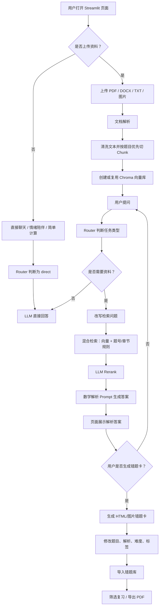
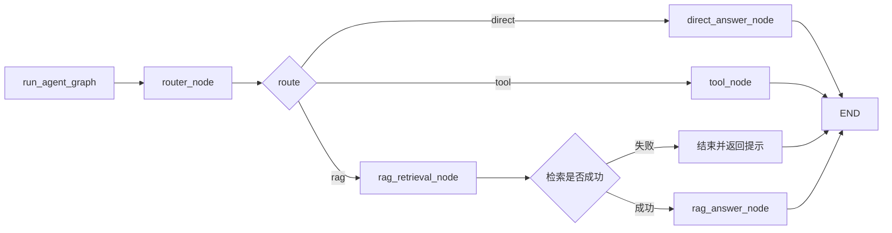
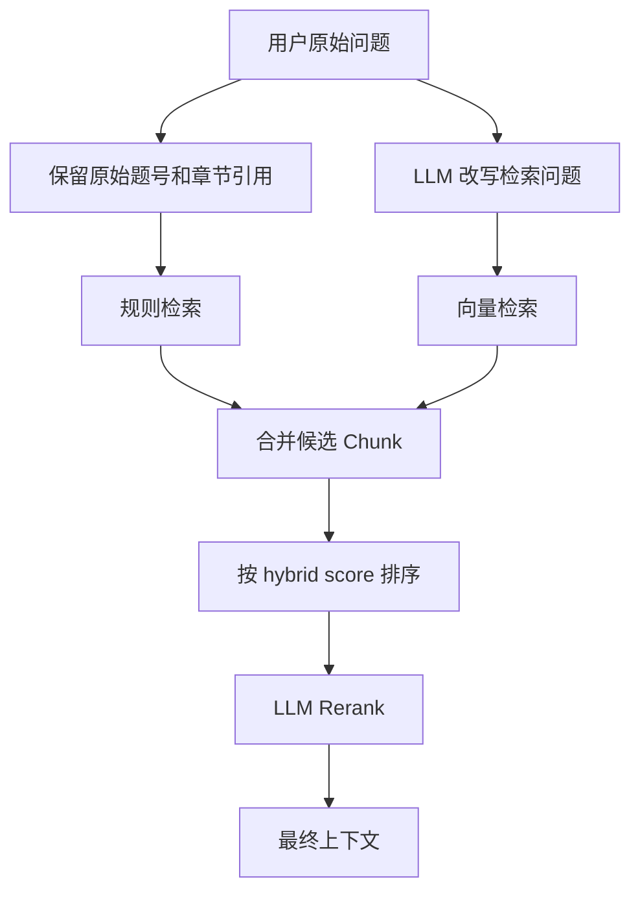
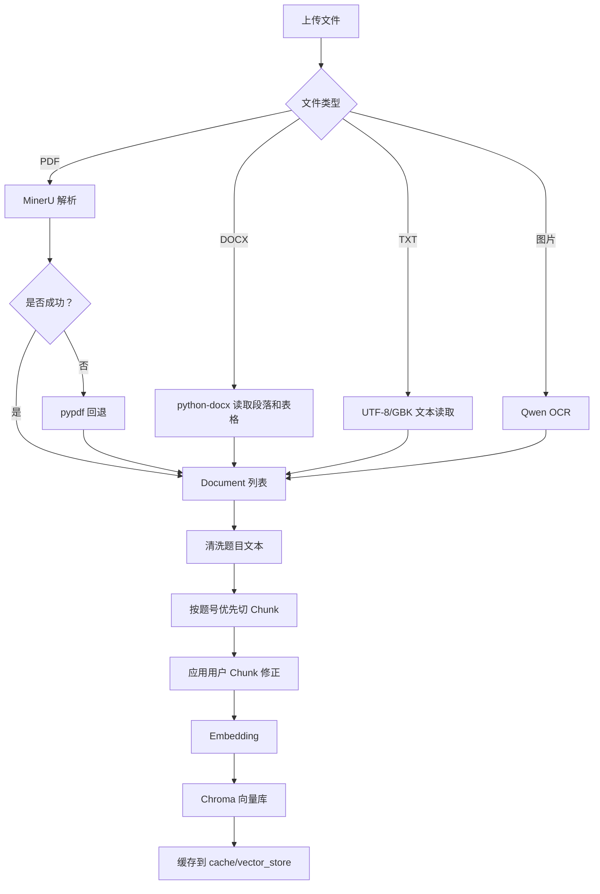
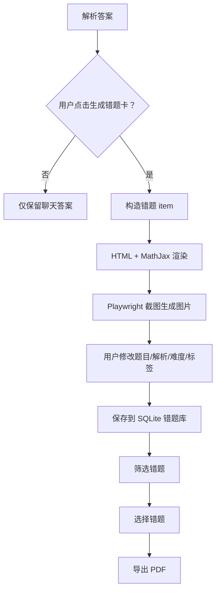

# Math-learning-agent

Math-learning-agent 是一个面向数学学习场景的 Streamlit Agent。它可以直接聊天，也可以在用户上传资料后进行资料问答、数学题解析、Chunk 校正、错题卡生成、错题库管理和 PDF 错题库导出。

项目的核心目标是把“普通陪伴式 Agent”和“基于学习资料的数学解析 Agent”放在同一个体验里：平常可以聊天、缓解情绪；当用户接入资料后，再进入严谨的资料检索、题目解析和错题整理流程。

## 功能概览

- 直接对话：支持日常聊天、学习建议、情绪陪伴、简单计算等不依赖资料的问题。
- 资料上传：支持 PDF、DOCX、TXT、PNG、JPG、JPEG、WEBP。
- PDF 解析：优先使用 MinerU 解析数学 PDF，失败后回退到 pypdf。
- 图片 OCR：使用视觉模型（Qwen-vl-ocr）识别题目图片。
- 题目检索：结合向量检索、题号规则、章节规则和 LLM Rerank。
- 数学解析：基于资料片段生成只包含解析答案的结果。
- 错题卡：用户点击后才生成错题卡，不在每次回答后自动生成。
- 错题库：支持错题持久化、筛选、复习状态、指定错题导出 PDF。
- Chunk 校正：允许用户查看、修改、保存资料切片修正，提高后续检索质量。
- 本地记忆：SQLite 保存会话历史和错题数据，运行数据默认不提交 Git。

## 技术栈

| 层级 | 技术 |
| --- | --- |
| UI | Streamlit |
| Agent 编排 | LangGraph |
| LLM | OpenAI-compatible API，默认 DashScope/Qwen |
| Embedding | Qwen Embedding |
| 向量库 | Chroma |
| 文档解析 | MinerU、pypdf、python-docx、Qwen OCR |
| 卡片渲染 | HTML、MathJax、Playwright、Pillow |
| 数据库 | SQLite |
| 测试 | unittest、自定义 harness |

## 总体流程



## Agent 工作流原理

LangGraph 的工作流入口在 `services/agent_graph.py`。每次用户提问都会进入同一个图：



### 1. Router

`services/rag_service.py` 调用 `prompts/router_prompts.py`，把用户问题分类为：

- `chit_chat`：普通聊天。
- `calculation`：简单计算，走直接 LLM 回答。
- `qa`：普通资料问答。
- `summary`：资料总结。
- `extract_points`：提取知识点。
- `question_solving`：题目解析。
- `format_answer`：整理格式。
- `log_query`：运行日志查询。

Router 同时判断 `need_rag`。如果不需要资料，就直接回答；如果需要资料，就进入 RAG。

### 2. RAG 检索

RAG 检索由 `services/retrieval_service.py` 和 `services/rerank_service.py` 组成：



规则检索会识别：

- `第 2 题`
- `第二题`
- `选择题第 3 题`
- `3.1 的第二题`
- `课后习题 1.1 中第二题`
- `第 3.1 节第 2 题`

这样可以避免用户问“3.1 的第二题”时被错误解析成“第 3 题”。

### 3. 数学解析

数学解析由 `services/math_exam_service.py` 负责。它会：

1. 把检索到的 Chunk 整理为上下文。
2. 推断题型。
3. 读取 `prompts/KAFANG_MODEL_PROMPT.md` 生成解析答案。
4. 读取 `prompts/KAFANG_VALIDATION_PROMPT.md` 做边界检查/修复。
5. 返回页面展示用的解析文本和错题卡候选 item。

当前设计中，用户提问后只展示解析答案；错题卡由用户点击后再生成。

## 文档解析和向量库原理



核心原则：

- 数学题资料优先保持单题完整，不轻易按固定长度切碎。
- PDF 优先 MinerU，因为公式、版式和扫描件对 pypdf 不友好。
- Chunk 修正会在创建向量库时应用，避免用户反复改同一个识别错误。
- 向量库可以按 Chunk hash 缓存，重复上传相同资料时复用结果。

## 错题卡和错题库流程



错题库本地保存在 `data/wrongbook.db`。卡片图片、HTML 和 PDF 导出文件分别写入：

- `data/cards/`
- `data/card_html/`
- `data/wrongbook_exports/`

这些目录都被 `.gitignore` 排除，避免把用户数据提交到 GitHub。

## 快速开始

### 1. 创建虚拟环境

```powershell
py -m venv .venv
.\.venv\Scripts\python.exe -m pip install --upgrade pip
```

### 2. 安装依赖

```powershell
.\.venv\Scripts\python.exe -m pip install -r requirements.txt
```

如果要使用错题卡 HTML 截图功能，安装 Playwright Chromium：

```powershell
.\.venv\Scripts\playwright.exe install chromium
```

### 3. 配置环境变量

```powershell
Copy-Item .env.example .env
```

至少配置：

```env
QWEN_API_KEY=replace-with-your-api-key
QWEN_BASE_URL=https://dashscope.aliyuncs.com/compatible-mode/v1
QWEN_CHAT_MODEL=qwen3.7-plus
QWEN_OCR_MODEL=qwen-vl-ocr
QWEN_EMBEDDING_MODEL=text-embedding-v4
```

`.env` 不会提交到 GitHub。

### 4. 启动

```powershell
.\.venv\Scripts\streamlit.exe run app.py
```

或：

```powershell
.\scripts\start.ps1
```

默认地址：

```text
http://localhost:8501
```

## 配置说明

主要配置集中在 `.env.example` 和 `config.py`。

| 变量 | 作用 |
| --- | --- |
| `QWEN_API_KEY` | DashScope/OpenAI-compatible API Key |
| `QWEN_BASE_URL` | OpenAI-compatible endpoint |
| `QWEN_CHAT_MODEL` | 路由、聊天、解析、RAG 生成模型 |
| `QWEN_OCR_MODEL` | 图片 OCR 模型 |
| `QWEN_EMBEDDING_MODEL` | Embedding 模型 |
| `USE_MINERU_FOR_PDF` | 是否优先使用 MinerU |
| `MINERU_CMD` | MinerU 可执行文件路径 |
| `ENABLE_VECTOR_CACHE` | 是否缓存 Chroma 向量库 |
| `ENABLE_SQLITE_MEMORY` | 是否启用本地聊天记忆 |
| `ENABLE_WRONGBOOK` | 是否启用错题库 |
| `MATHJAX_CDN_URL` | HTML 卡片 MathJax 地址 |

## 文件功能索引

### 根目录

| 文件 | 功能 | 原理/说明 |
| --- | --- | --- |
| `app.py` | Streamlit 主入口 | 组装页面、左侧导航、资料上传、聊天、错题卡、错题库、导出和日志写入。 |
| `config.py` | 全局配置 | 从 `.env` 读取模型、路径、Chunk、MinerU、Rerank、错题库等参数。 |
| `.env.example` | 环境变量模板 | 给新用户复制为 `.env`，避免提交真实密钥。 |
| `.gitignore` | Git 忽略规则 | 排除密钥、虚拟环境、数据库、缓存、日志、用户资料。 |
| `.dockerignore` | Docker 忽略规则 | 构建镜像时排除本地运行产物。 |
| `Dockerfile` | Docker 镜像定义 | 安装依赖并启动 Streamlit。 |
| `DEPLOYMENT.md` | 部署说明 | 记录本地、Docker、验证和清理流程。 |
| `README.md` | 项目说明 | 当前文件。 |
| `requirements.txt` | Python 依赖 | 精简后的项目依赖清单。 |

### `prompts/`

| 文件 | 功能 | 原理/说明 |
| --- | --- | --- |
| `prompts/router_prompts.py` | 任务路由 Prompt | 让 LLM 判断任务类型、是否需要 RAG、回答格式。 |
| `prompts/direct_prompts.py` | 直接回答 Prompt | 用于普通聊天、情绪陪伴、天气类说明、简单计算等非 RAG 问题。 |
| `prompts/retrieval_prompts.py` | 检索改写 Prompt | 把用户问题改写成适合向量检索的查询，同时保留原问题给规则检索。 |
| `prompts/answer_prompts.py` | 通用 RAG 回答 Prompt | 非数学专用模式下，根据资料片段生成答案。 |
| `prompts/rerank_prompts.py` | Rerank Prompt | 让 LLM 判断候选 Chunk 与问题的相关性。 |
| `prompts/ocr_prompts.py` | 图片 OCR Prompt | 指导视觉模型识别题目图片中的文字、公式和选项。 |
| `prompts/math_exam_prompts.py` | 数学解析 Prompt 组装 | 读取 KAFANG Prompt 文件，并注入问题、资料片段、来源和历史上下文。 |
| `prompts/KAFANG_MODEL_PROMPT.md` | 数学解析主 Prompt | 规定解析输出口径、学习产品风格和 LaTeX 表达。 |
| `prompts/KAFANG_VALIDATION_PROMPT.md` | 数学解析边界检查 Prompt | 对解析结果做修复和边界约束。 |
| `prompts/validation_prompts.py` | 通用回答修复 Prompt | 通用 RAG 输出不合格时用于修复。 |

### `services/`

| 文件 | 功能 | 原理/说明 |
| --- | --- | --- |
| `services/agent_state.py` | LangGraph 状态定义 | 用 TypedDict 描述工作流中传递的字段。 |
| `services/agent_graph.py` | Agent 工作流 | Router 后分流到 direct/tool/RAG，并串联检索、Rerank、生成。 |
| `services/rag_service.py` | RAG 公共服务 | 调用 LLM 完成任务分类、检索改写、直接回答、通用 RAG 回答和输出校验。 |
| `services/retrieval_service.py` | 混合检索 | 题号/章节规则检索 + Chroma 向量检索 + 分数融合。 |
| `services/rerank_service.py` | LLM 重排 | 对候选 Chunk 重新打分，挑选最终上下文。 |
| `services/vector_service.py` | 切分和向量库 | 清洗文本、题目优先 Chunk、应用修正、创建 Chroma、缓存向量库。 |
| `services/document_loader.py` | 文件读取入口 | 按文件类型路由到 PDF、DOCX、TXT、图片 OCR。 |
| `services/mineru_loader.py` | MinerU PDF 解析 | 调用 MinerU，支持缓存、分批、质量检查和回退。 |
| `services/mineru_cache.py` | MinerU 缓存 | 用文件内容和配置生成 cache key，避免重复解析。 |
| `services/mineru_cleaner.py` | MinerU Markdown 清洗 | 清理 MinerU 输出中的噪声，提升后续 Chunk 质量。 |
| `services/pdf_quality_service.py` | PDF 解析质量评估 | 检查乱码率、空行、文本长度等指标，辅助判断解析质量。 |
| `services/exam_text_cleaner.py` | 题目文本清洗 | 修复粘连选项、题号、URL 噪声等。 |
| `services/question_chunker.py` | 题目优先切分 | 识别题号 marker，尽量保持单题完整。 |
| `services/question_parser_service.py` | 题目结构解析 | 从 Chunk 中抽取题干、选项等结构化信息。 |
| `services/math_exam_service.py` | 数学解析服务 | 构造资料上下文，调用数学 Prompt，生成解析答案和错题 item。 |
| `services/card_render_service.py` | 图片错题卡渲染 | 生成基础卡片图片，推断题目文本和来源信息。 |
| `services/card_html_render_service.py` | HTML 错题卡渲染 | 用 HTML + MathJax 渲染公式，再用 Playwright 截图。 |
| `services/card_edit_service.py` | 错题卡编辑 | 根据用户修改重建错题 item。 |
| `services/wrongbook_service.py` | 错题库 | SQLite 表结构、错题保存、筛选、复习状态、PDF 导出。 |
| `services/memory_service.py` | 会话记忆 | SQLite 保存会话、读取历史、清空当前会话。 |
| `services/log_service.py` | 运行日志 | 记录每次问答的任务类型、检索来源、耗时和错误。 |
| `services/export_service.py` | 对话导出 | 把聊天记录导出为 TXT/DOCX。 |
| `services/chunk_debug_service.py` | Chunk 调试数据 | 构造 Chunk 表格、过滤、预览内容。 |
| `services/chunk_quality_service.py` | Chunk 质量检查 | 检查多题混入、选项粘连等问题。 |
| `services/correction_store_service.py` | Chunk 修正存储 | 保存用户对 Chunk 的修正，并在切分后应用。 |
| `services/llm_service.py` | LLM 客户端 | 创建聊天、OCR、Embedding 模型客户端并检查环境变量。 |

### `services/tools/`

| 文件 | 功能 | 原理/说明 |
| --- | --- | --- |
| `services/tools/__init__.py` | 工具包入口 | 保持 tools 包可导入。 |
| `services/tools/tool_registry.py` | 工具注册表 | 当前保留 `log_query`，计算类问题改为直接 LLM 回答，避免本地计算工具和 LLM 口径冲突。 |

### `ui/`

| 文件 | 功能 | 原理/说明 |
| --- | --- | --- |
| `ui/theme.py` | 页面主题 | 注入 Streamlit CSS，控制导航、卡片、抽屉、输入区、错题库等视觉。 |
| `ui/result_views.py` | 结果视图 | 渲染错题卡等结果块。 |
| `ui/chunk_debug_panel.py` | Chunk 校正面板 | 展示 Chunk 列表、质量提示、用户修正入口。 |
| `ui/__init__.py` | UI 包入口 | 保持 ui 包可导入。 |

### `state/`

| 文件 | 功能 | 原理/说明 |
| --- | --- | --- |
| `state/session_state.py` | Streamlit 状态初始化 | 定义上传资料、聊天、错题卡、抽屉、过滤器等 session state 默认值和重置函数。 |
| `state/__init__.py` | state 包入口 | 保持 state 包可导入。 |

### `validators/`

| 文件 | 功能 | 原理/说明 |
| --- | --- | --- |
| `validators/task_validator.py` | Router 输出校验 | 规范 task_type、need_rag 等字段，防止模型返回异常结构。 |
| `validators/answer_validator.py` | 通用答案校验 | 检查 RAG 答案格式和必需字段。 |
| `validators/math_exam_output_validator.py` | 数学输出校验 | 校验数学解析 JSON/条目结构。 |

### `scripts/`

| 文件 | 功能 | 原理/说明 |
| --- | --- | --- |
| `scripts/start.ps1` | Windows 启动脚本 | 检查 Streamlit 并启动应用。 |
| `scripts/check_env.py` | 环境检查 | 检查模型配置、依赖、MinerU、Playwright、SQLite 写入路径。 |
| `scripts/run_harness.py` | 验证入口 | 串联语法检查、单元测试、环境检查、Streamlit smoke test、Eval。 |
| `scripts/clean_runtime.py` | 运行目录清理 | 清理缓存、日志、MinerU 临时目录。 |
| `scripts/__init__.py` | scripts 包入口 | 让测试可以导入脚本函数。 |

### `evals/`

| 文件 | 功能 | 原理/说明 |
| --- | --- | --- |
| `evals/eval_cases_v2.json` | 评估用例 | 定义路由、RAG、日志、题目解析等评估问题和期望字段。 |
| `evals/run_eval_v2.py` | Eval 执行器 | 加载 `evals/source_docs/` 文档，运行 Agent，统计命中和输出质量。 |
| `evals/build_eval_report.py` | Eval 报告 | 生成 HTML/JSON 趋势报告。 |
| `evals/source_docs/.gitkeep` | 占位文件 | 保留目录；真实评估资料不提交。 |

### `tests/`

| 文件 | 覆盖范围 |
| --- | --- |
| `tests/test_chunk_debug_service.py` | Chunk 调试表格、过滤、预览。 |
| `tests/test_chunk_quality_service.py` | Chunk 质量检查。 |
| `tests/test_clean_runtime.py` | 运行目录清理脚本。 |
| `tests/test_correction_store_service.py` | Chunk 修正保存和应用。 |
| `tests/test_eval_report.py` | Eval 报告生成。 |
| `tests/test_eval_v2.py` | Eval 统计、趋势、跳过逻辑。 |
| `tests/test_exam_text_cleaner.py` | 题目文本清洗。 |
| `tests/test_llm_calculation_routing.py` | 计算任务走直接 LLM，不走工具。 |
| `tests/test_math_exam_output_validator.py` | 数学解析输出校验。 |
| `tests/test_memory_service.py` | 会话记忆写入和读取。 |
| `tests/test_mineru_cache.py` | MinerU cache key。 |
| `tests/test_question_chunker.py` | 题目优先切分。 |
| `tests/test_question_parser_service.py` | 题目结构解析。 |
| `tests/test_retrieval_hybrid.py` | 混合检索排序和原始问题保留。 |
| `tests/test_retrieval_service.py` | 题号、章节号、规则检索。 |
| `tests/test_task_validator.py` | 任务分类校验。 |
| `tests/test_vector_service.py` | Chroma metadata 规范化。 |
| `tests/test_wrongbook_service.py` | 错题库筛选、复习、PDF 导出。 |

## 数据目录

这些目录运行时自动生成，不提交 GitHub：

| 目录 | 内容 |
| --- | --- |
| `data/` | SQLite 数据库、错题卡、错题 PDF 导出。 |
| `cache/` | Chroma 向量库、MinerU Markdown 缓存。 |
| `logs/` | Agent CSV 运行日志。 |
| `mineru_runtime/` | MinerU 临时输入输出。 |
| `.codex/` | Codex 本地截图和临时资料。 |
| `.agents/` | Codex/Agent 本地状态。 |

## 验证

普通修改：

```powershell
.\.venv\Scripts\python.exe scripts\run_harness.py --mode quick
```

完整启动验证：

```powershell
.\.venv\Scripts\python.exe scripts\run_harness.py --mode full --port 8501
```

运行 Eval V2：

```powershell
.\.venv\Scripts\python.exe scripts\run_harness.py --mode full --eval
```

Eval 可能调用真实 API。需要 RAG 评估资料时，把文档放入 `evals/source_docs/`。

## Docker

```powershell
docker build -t math-learning-agent .
docker run --rm -p 8501:8501 --env-file .env math-learning-agent
```

如果容器里需要 HTML 错题卡截图，需要额外安装 Playwright Chromium 浏览器二进制。

## 常见问题

### 图片无法 OCR

检查 `QWEN_OCR_MODEL` 是否为支持视觉输入的模型，并确认 API Key 有模型权限。

### PDF 解析效果差

优先检查 MinerU：

```powershell
.\.venv\Scripts\python.exe scripts\check_env.py
```

MinerU 不可用时会回退到 pypdf，但公式、扫描版和复杂版式效果会下降。

### 问“第几题”找不到内容

确认资料已上传并建立向量库。系统支持题号和章节号引用，但资料解析后的 Chunk 中也需要保留对应题号或章节信息。

### 错题 PDF 导出失败

PDF 导出依赖已经生成的错题卡图片。请先生成错题卡并导入错题库，再选择导出。

## 提交前检查

```powershell
git status --short
git ls-files --others --exclude-standard
```

不要提交：

- `.env`
- `.venv/`
- `data/`
- `cache/`
- `logs/`
- `mineru_runtime/`
- 用户上传的资料
- 生成的错题卡和 PDF
